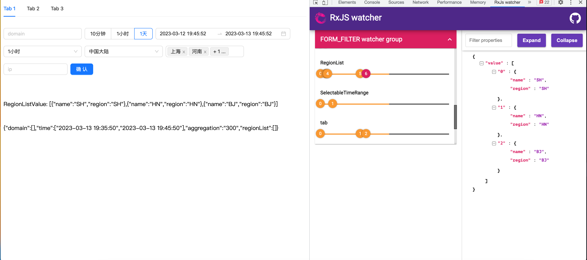

# 基于 RxJS 的状态生成器



**NPM地址** [@yhfu/re-gen](https://www.npmjs.com/package/@yhfu/re-gen)

> demo地址: https://stackblitz.com/edit/react-ts-wv4a9d?file=App.tsx,config.ts,index.html

> 🚀 此库功能基本完备，测试demo均通过，可放心使用

## 为什么会有该库

> 💡 最初的想法是应用于状态和UI分离的开发方式之中，通过声明的方式描述状态以及其依赖和处理方式，通过工具对其进行构建
> 
> 💡 之后探索了一下 RxJS 的开发模式，发现我想做的工具其实就是使用 RxJS 开发的一个较为通用的开发模式（数据流）
> 
> 💡 最近在探索前端组件/页面复用方案的时候，发现其实这个工具可以作为一个底层构建工具，通过复用状态声明（描述状态以及其依赖和处理方式的配置文件）达到逻辑上的复用，**完全符合最初的想法** 🤔️
> 
> 🚀 **更多的复用方案会在之后的仓库中进行更详细的描述**


 
## 什么场景适合使用？

> 主要的场景聚焦在一个组件的开发当中。当然一个页面的开发过程中也可以使用，可能会遇到状态太多而导致不易维护（该库也提供了状态拆分的方案，详见demo）。

## Demo 说明

### apps/FormFilter

这是一个实际的 demo，你会发现在这种场景下工具使用起来会非常的丝滑，因为这个工具的诞生就是为了这种场景的需求。它主要以多个不同的 field 之间进行联动，其次就是比较关键的地方在于它们的数据源都来自组件，包括
change click 等进行驱动，这也是 RxJS 能适用的原因之一。

### app/Form

这是一个非常规的demo，主要展示的是一个数据是通过其他数据源驱动更新自身（reduce）的一个场景。因为 RxJS 自身的原因，并不能很好地区分到底是哪个依赖产生了变化，所以需要写一些功能性（ 例如去重 ）之类的代码，或者是引入新的变量来标识具体是哪个变量发生了变化（ 类似于
redux 派发 action ）。

## 接入方式

如果使用该工具，需要提供一组配置项，其中单个配置项的格式如下所示，具体使用方式可以参照 apps/demo/src/config.ts 的配置文件。

```typescript
interface IConfigItem {
  name: string;
  init?: IConfigItemInit;
  handle?: (arg: any) => ReturnResult;
  distinct?: IDistinct;
  reduce?: {
    handle: (pre: any, val: any) => any;
    init: any;
  };
  filterNil?: FilterNilStage;
  depend?: {
    names: string[];
    handle: (args: any[]) => ReturnResult;
    combineType?: CombineType;
  };
}
```

### 具体使用方法

> 详细代码可参考 apps/demo 项目  https://stackblitz.com/edit/react-ts-wv4a9d?file=App.tsx,config.ts,index.html

- 创建配置项列表

```typescript
// 处理函数支持 async/await 以及返回 Observable 的形式
// 如果你熟悉 RxJS 的话，那将会有很好的体验

export const RelationConfig: IConfigItem[] = [
  {
    name: "area",
    handle(val) {
      return of(val);
    },
  },
  {
    name: "region",
    handle: (val: string[] = []) =>
        from(val).pipe(
              filter(Boolean),
              map((item) => item?.toLocaleUpperCase()),
              toArray()
        ),
  },
  {
    name: "showRegion",
    init: false,
    depend: {
      names: ["area"],
      handle([show, area]: [show: boolean, area: string]) {
        if (area === "CN") {
          return true;
        }
        return false;
      },
    },
  },
  {
    name: "testMoreDepend",
    init: "",
    depend: {
      names: ["showRegion", "RegionList"],
      handle: async ([testMoreDepend, showRegion, RegionList]: [
        testMoreDepend: string[],
        showRegion: boolean,
        RegionList: string[]
      ]) => JSON.stringify(showRegion) + JSON.stringify(RegionList?.length),
    },
  }
];
```

### 接下来可以使用hook进行操作

- 通过包导出的 `useReGen` 方法，分别传入 `CacheKey` 以及 `RelationConfig` 参数进行调用即可
- 函数会返回一个对象，通过解构对象，从而获取 `${name}`。其中 `${name}` 会被替换为 `RelationConfig` 中的name值
- 返回值中会存在一个特殊的名为 `ReGenValue` 的对象，从中可以结构出获取或修改值的方法: `getValue` `getAtom` `setValue`, 这些方法默认修改的是当前传入的`CacheKey`对应的值。
- 如果是在非组件的位置修改对应的值，可以通过包导出的 `getValue` `getAtom` `setValue` 进行修改，与hook导出的方法相比，需要第一个参数传入需要修改的`CacheKey`
```typescript
// 使用方法
const {
  area,
  region,
  ReGenValue: {setValue, getValue, getAtom}
} = useReGen( "CacheKey", RelationConfig );


// hook 导出的函数签名
ReGenValue: {
  getValue: {
    (): Record<string, any>
    ( name: string ): any
  }
  getAtom: {
    (): Record<string, BehaviorSubject<any>>
    (name: string): BehaviorSubject<any>
  }
  setValue: {
    (name: string): (value: any) => void
    (name: string, value: any): void
  }
}

// 全局导出的函数签名
export function getValue(CacheKey: string): Record<string, any>
export function getValue(CacheKey: string, name?: string): any

export function getAtom(CacheKey: string): Record<string, BehaviorSubject<any>>
export function getAtom(CacheKey: string, name?: string): BehaviorSubject<any>

export function setValue(CacheKey: string, name: string): (value: any) => void
export function setValue(CacheKey: string, name: string, value?: any): void
```

### 全局可选配置项

#### 调试日志

日志服务使用的是 `rxjs-watcher` 的库。开启方法是传入第三项配置项 `logger: { duration?:number } | boolean | number`，其中 `duration`
为可观察的持续时间。如需看到每个 Observable 的具体情况，请安装 `rxjs-watcher` 相关浏览器插件即可。

```typescript
ReGen( CacheKey, RelationConfig, { logger: { duration: 300 } } )
```

#### 空值处理

```typescript
// 全局配置
// 默认值 false
// type FilterNilStage = "All" | "Default" | "In" | "HandleAfter" | "DependAfter" | "Out"
// All 表示全局开启过滤 
// Default 表示默认策略（处于 In 和 Out 阶段且不进行过滤）
// "In" | "HandleAfter" | "DependAfter" | "Out" 表示不同的阶段进行空值处理

useReGen( "CacheKey", RelationConfig, { filterNil: FilterNilStage | boolean } );

// 局部配置
// 单独对当前状态进行空值过滤
// 优先级高于全局配置
[{
    name: "area",
    filterNil: FilterNilStage | boolean
}]
```

> `combineLatestWith` 的处理方式是当所有的 `Observable` 都有值的时候，才会通过第一个值
> 
> `withLastestFrom` 的处理方式是其他的 `Observable` 有值之后，再次触发上游 `Observable` 才会通过第一个值
> 
> 所以在过滤的时候如果不熟悉上边的条件，**_建议每个配置项都写上 `init` 并且不对 `filterNil` 进行设置_**

#### 重复值过滤

默认全局开启，使用 `ramda` 中的 `equals` 进行对比

```typescript
// 全局配置
useReGen( CacheKey, RelationConfig, { distinct: true } );

// 局部配置
// 单独对当前状态进行去重
// 建议使用布尔值进行配置，如需使用高级方法，可参见 RxJS distinctUntilChanged 操作符相关设置
[{
  name: "area",
  distinct: IDistinct
}]

type IDistinct<T, K> =
        | boolean
        | {
  comparator: ( previous: K, current: K ) => boolean; keySelector?: ( value: T ) => K;
};
```


